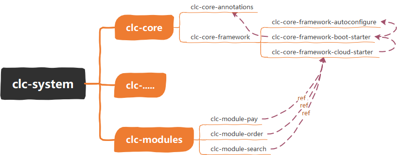

This is an example from a discussion: https://stackoverflow.com/questions/74958900/using-the-parent-module-scope-as-a-test-dependency-in-the-maven-sub-module

I want to explain my original idea:  
When I reconstructed the old system, I found that 99% of the dependent modules were duplicate (C+V). To solve this problem, I constructed a starter pom (we call it xxx cloud starter) that is common to all modules. In this way, without changing the parent of the original module, directly introducing cloud-start can replace those duplicate code blocks

like this:

After the design is completed, I think it has no problem; Until I asked a question at StackOverflow, `khmarbaise` reminded me (I really thank him for reminding me, otherwise I would always use this architecture directory). After thinking for a long time, I found the following problems in this architecture
1. The update frequency of core module may be high.
2. In the future, when selecting the most appropriate technology stack for the module, you need to use`<dependencyManagement>`and`<exclusions>`.
3. I still need to set the contents of some core modules in the top-level modules.
4. There may be other problems I didn't think of....

#### The update frequency of core module may be high
Since I have encapsulated all the dependencies related to the framework into the core module, if I don't think of the technology that may be used in the future, I need to go to the core module in time to supplement.

#### In the future, when selecting the most appropriate technology stack for the module, you need to use`<dependencyManagement>`and`<exclusions>`
Yes, I think the technical implementation should not be limited to a certain choice. I hope it can find the most suitable solution. For example, 'clc module pay' in this example may use postgresql as a database. In order to keep the version unified, it must exclude mysql in 'cloud starter' and add the<dependencyManagement>of 'boot starter' to add the dependency of the unified version.

#### I still need to set the contents of some core modules in the top-level modules
For example, test dependency in all modules.

Maybe it will be useful in the case of fixed technology stack, but I think it is not suitable for me. I am rethinking and constructing a new dependency structure. If you have any suggestions, welcome to discuss.